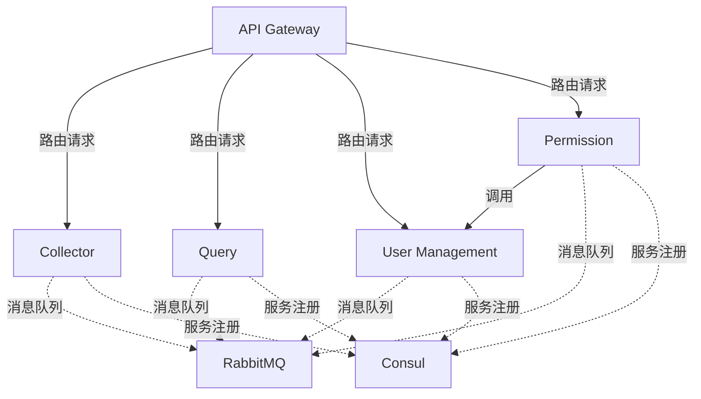

# 微服务架构文档

## 架构图

## 模块功能说明

### 1. API Gateway
- **端口**: 8080
- **功能**:
  - 系统统一入口
  - 请求路由和负载均衡
  - 统一认证和鉴权入口
  - 请求限流和熔断

### 2. Collector
- **端口**: 8002
- **功能**:
  - 数据采集和处理
  - 异步任务处理
  - 数据存储到trends.db
  - 支持定时任务和实时采集

### 3. Query
- **端口**: 8001
- **功能**:
  - 数据查询和分析
  - 支持复杂查询条件
  - 数据缓存优化
  - 使用query.db存储数据

### 4. User Management
- **端口**: 8003
- **功能**:
  - 用户注册和登录
  - 用户信息管理
  - JWT token生成
  - 密码加密存储

### 5. Permission
- **端口**: 8004
- **功能**:
  - 角色和权限管理
  - 访问控制列表(ACL)
  - 权限验证服务
  - 依赖User Management服务

## 基础设施

### Consul
- **端口**: 8500
- **功能**:
  - 服务发现与注册中心
  - 健康检查
  - 配置中心

### RabbitMQ
- **端口**: 5672(AMQP), 15672(管理界面)
- **功能**:
  - 消息队列服务
  - 异步通信
  - 任务队列
  - 事件驱动架构支持